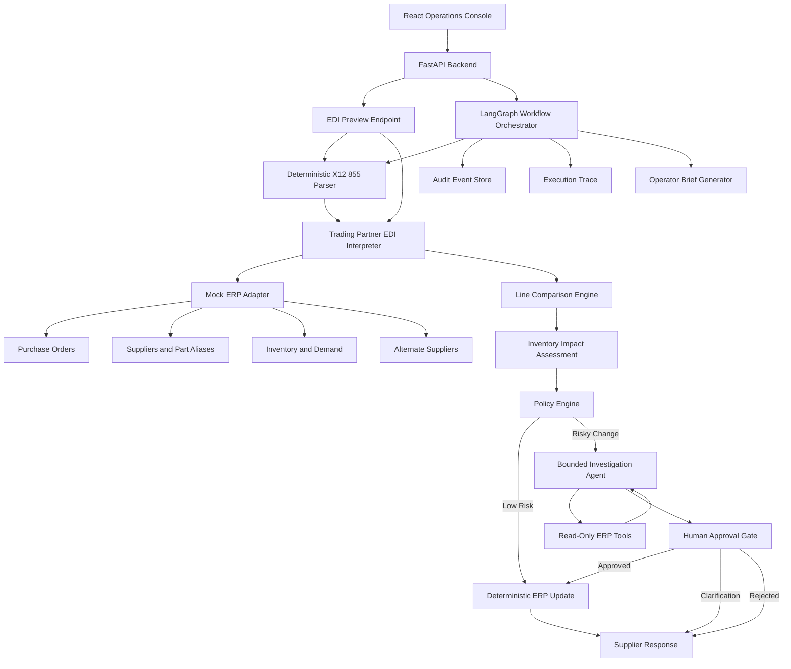

# ProcureOps AI: Governed Supplier Order Digital Worker

ProcureOps AI is an enterprise procurement automation system that processes inbound X12 855 supplier acknowledgments, compares them against purchase orders, evaluates operational risk, routes exceptions for human approval, and preserves an auditable execution trail.

Try here: https://procureops-console.onrender.com/

## Overview

Procurement teams receive supplier acknowledgments after issuing purchase orders. These acknowledgments may confirm the order exactly, or they may change quantity, price, delivery date, part number, unit, or currency.

ProcureOps AI automates this process by:

- parsing inbound X12 855 EDI acknowledgments
- interpreting supplier-specific EDI semantics through trading partner profiles
- comparing confirmations against ERP purchase orders
- assessing inventory and shortage impact
- applying deterministic approval policies
- using bounded AI agents for investigation and operator briefing
- requiring human approval before risky ERP updates
- recording all decisions in an audit trail

## Key Capabilities

- Deterministic X12 855 parsing and trading-partner-specific semantic interpretation
- Mock ERP with purchase orders, suppliers, part aliases, inventory, demand, and alternate suppliers
- Structured EDI preview for readable intake before ingestion
- LangGraph workflow orchestration for supplier acknowledgment processing
- Bounded read-only investigation agent for risky supplier changes
- LLM-generated operator brief and supplier clarification draft with guardrails
- Human approval gate before ERP mutation
- Idempotency protection against duplicate acknowledgments
- Audit timeline and digital worker execution trace
- Scenario evaluations for happy paths and exception paths

## Architecture



## Agentic Design

The system uses bounded agency rather than unrestricted autonomy.

LangGraph coordinates a multi-step digital worker workflow. The worker receives an operational objective, maintains workflow state, invokes tools, gathers context, pauses for human approval, and resumes execution after authorization.

AI is used for:

- bounded risk investigation
- read-only contextual retrieval
- operator briefing
- supplier-facing message drafts

AI is not used for:

- EDI syntax parsing
- financial calculations
- approval threshold decisions
- idempotency checks
- ERP write authorization

ERP mutations remain deterministic and require policy approval or explicit human approval.

## Run Locally

### Prerequisites

- Docker Desktop
- OpenAI API key, optional but recommended for LLM investigation and operator briefs

### 1. Clone And Configure

```bash
git clone <repo-url>
cd supplier-order-digital-worker
cp .env.example .env
```

Set:

```env
OPENAI_API_KEY=your_api_key_here
OPENAI_MODEL=gpt-5.4-mini
OPENAI_INVESTIGATION_MODEL=gpt-5.4-mini
OPENAI_TIMEOUT_SECONDS=20
ENABLE_LLM_INVESTIGATION=true
```

### 2. Start The Stack

```bash
docker compose up -d --build
```

### 3. Open The App

```text
Frontend: http://localhost:5173
Backend API: http://localhost:8000
API docs: http://localhost:8000/docs
Liveness: http://localhost:8000/live
Readiness: http://localhost:8000/ready
JSON metrics: http://localhost:8000/api/metrics
Metrics exporter: http://localhost:8000/metrics
```

### 4. Stop The Stack

```bash
docker compose down
```

### 5. Reset Local Data

```bash
docker compose down -v
docker compose up -d --build
```

## Example Workflow

1. Open the app at `http://localhost:5173`.
2. Go to **Mock ERP**.
3. Review `PO-1042`, supplier context, inventory, and demand.
4. Click **Load changed acknowledgment**.
5. Go to **Operations**.
6. Review the structured EDI preview.
7. Click **Ingest EDI**.
8. Inspect the execution trace, line comparison, impact assessment, policy decision, risk investigation, and operator brief.
9. Choose approve, reject, or request clarification.
10. Review the audit timeline and ERP update snapshot.

## Testing

Run backend tests:

```bash
PYTHONPATH=backend pytest -q backend/tests
```

Build frontend:

```bash
cd frontend
npm run build
```

Run scenario evaluations from the UI:

```text
Evaluations -> Run scenarios
```

## Project Structure

```text
backend/
  app/
    services/
      edi_parser.py          # deterministic X12 syntax parser
      edi_interpreter.py     # partner-specific semantic interpretation
      workflow.py            # LangGraph workflow orchestration
      investigation.py       # bounded read-only investigation agent
      policy.py              # deterministic approval policy
      impact.py              # inventory and shortage impact assessment
      mock_erp.py            # mock ERP adapter

frontend/
  src/
    main.jsx                 # React operations console
    styles.css               # UI styling

sample-data/
  edi/                       # X12 855 sample acknowledgments

evaluations/
  scenarios/                 # scenario test definitions

docs/
  PROJECT_SOURCE_OF_TRUTH.md # canonical project specification
```

## Observability

The backend emits structured JSON logs for HTTP requests and workflow audit events. The operations console and API expose workflow metrics including automation rate, manual-review rate, retry recovery, LLM fallback rate, failed notifications, and average workflow duration.

Workflow detail pages include a digital worker execution trace backed by `GET /api/workflows/{workflow_id}/execution-trace`. The trace maps audit events into LangGraph-oriented steps such as EDI parsing, semantic interpretation, PO retrieval, policy evaluation, bounded risk investigation, human approval, operator briefing, ERP update, supplier notification, and completion.

## Design Principles

- Deterministic logic for business-critical decisions
- Human approval before risky ERP updates
- Bounded AI usage with read-only tool access
- Full auditability and replay-safe workflow behavior
- Clear separation between EDI parsing, semantic interpretation, policy, investigation, and execution
